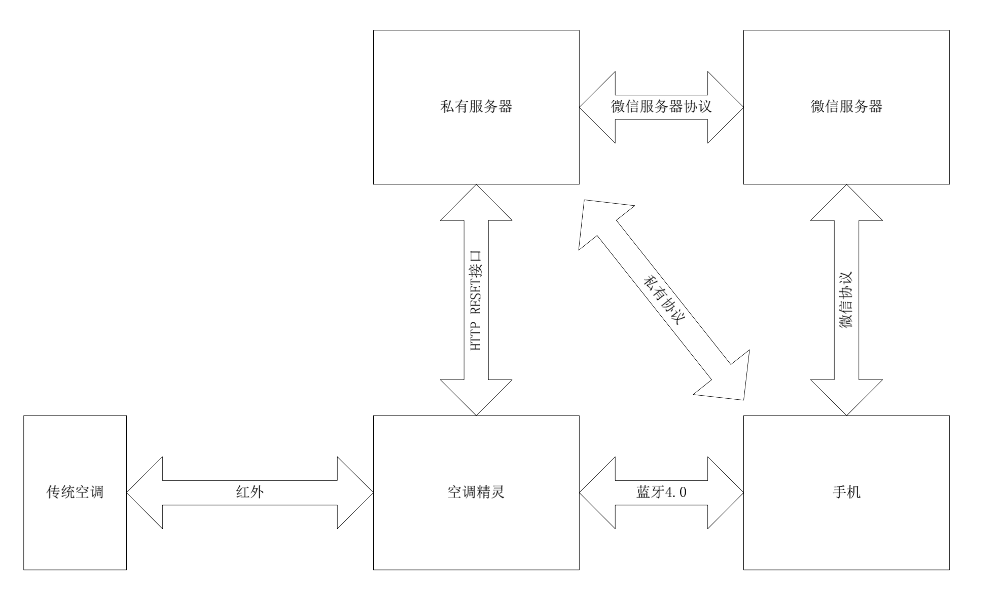

## 开源项目－空调精灵

本文档为总括性文档，整体描述了系统的`功能性需求`、`系统组成`和`系统交互`，系统各个模块的具体功能定义和实现接口，请参考对应模块的接口规范文档

##1 用户级
本章节类似`用户说明书`，提供简单的功能特性和使用说明

###1-1 功能定义
- ＃1 能通过红外遥控空调
- ＃1 能通过蓝牙4.0连接安卓／iOS手机
- ＃1 能Wi-Fi连接家庭网络
- ＃1 能显示当前操作
- ＃1 手机能查看每个房间的温度
- ＃1 支持有线电源供电形式
- ＃2 内置红外学习算法，支持各类空调
- ＃2 红外遥控范围360度无差别覆盖
- ＃3 能联网自动更新空调库

NOTE：`＃x` 表示任务优先级，数字越小，优先级越高

###1-2 用户交互
本节主要描述用户怎么使用`空调精灵`

1.	用户将`空调精灵`安装到空调附近，用户必须保证不被`空调精灵`红外信号不被完全遮挡
2. 用户	开机后，将`空调精灵`连接室内Wi-Fi网络
3. 如果`空调精灵`有触摸屏，则通过触摸屏输入Wi-Fi SSID和Password；如果没有触摸输入机构，则通过蓝牙4.0来配置Wi-Fi接入参数
4.	`空调精灵`能显示当前BLE，Wi-Fi连接状态和空气温度信息
5.	`空调精灵`接入网络后，自动下载更新遥控器数据或者升级固件，提供给用户空调选择界面，让用户选择对应的空调型号
6.	如果空调列表中，没有对应的型号，`空调精灵`提供自动学习机制，能学习记录用户遥控动作和保存到网络
7.	用户可以通过触摸屏或者手机来调整室内温度


## 2 内部级
本章节侧重说明空调精灵实现原理，并说明系统内部模块之间的数据流向和交互行为

###2-1 系统架构


###2-2 系统构成

`#1 处理器`
STM32系列MCU，本次采用ST F7高性能系列MCU
``` C
NOTE：软件架构属于跨平台，不限于特定MCU
```

`#2 供电系统`
第一版：外部供电，输入5V－1A，DC－DC接口
第二版：电池供电，待机1个月

`#3 显示`
触摸屏，显示当前系统状态和调整温度
LED，显示当前连接和系统状态

`#4 蓝牙`
提供与手机连接通道，单点通信，无加密

`#5 Wi-Fi`
提供网络接入能力，从而达到联网更新和远程控制的目的

`#6 APP`
提供远程控制能力

`#7 红外`
控制空调和学习新空调算法

``` C
NOTE：红外部分必须具备自学习能力，且遥控器数据以文件系统格式外部存储
```

`#8 MQTT服务器`
提供多点之间数据传输链路和控制链路，调试阶段采用免费的MQTT服务器，推荐`云巴`

###2-3 系统数据流
占位符：说明系统运行时，各个模块之间的交互行为

###2-4 模块功能定义／行为定义
占位符：参见`空调精灵－XX模块－规范`功能定义和行为定义章节

###2-5 模块接口定义
占位符：参见`空调精灵－XX模块－规范`接口定义章节

##3 后期拓展
**方向A:** 可以考虑做成手机端的IR设备，直接插入耳机孔，从而将智能手机变成遥控器
**方向B:** 拓展为家庭网关中心

##4 相关文档
占位符：`空调精灵－XX模块－规范`
占位符：`空调精灵－红外数据格式规范`
占位符：`空调精灵－MQTT数据传输协议`

##5 更新记录
- V1.0 2015-09-08 Cedar 完成框架
- V1.1 2015-09-11 Cedar 初稿
